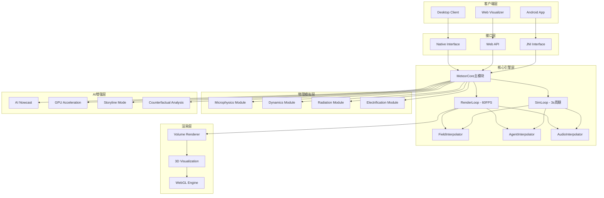
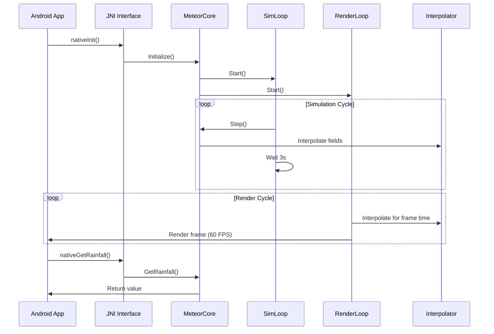
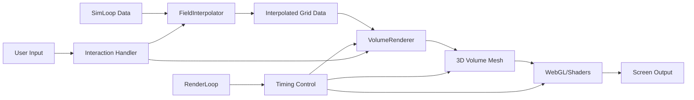
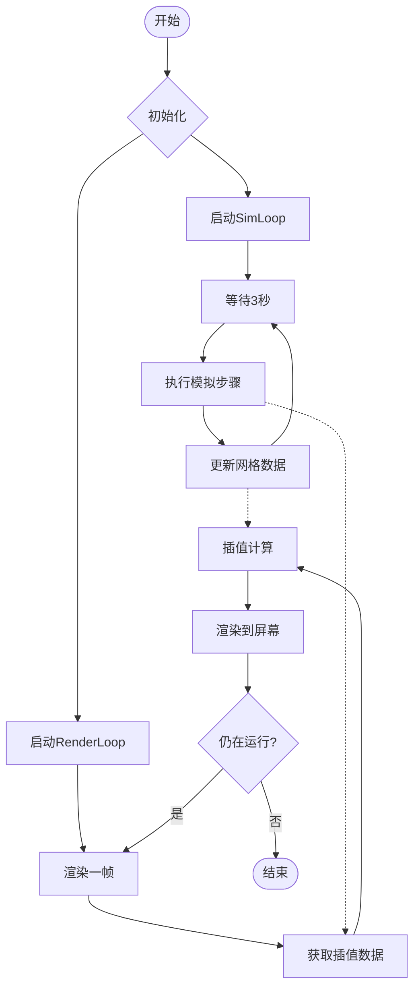

# 系统架构图



# 类图

```mermaid
classDiagram
    class MeteorCore {
        +Initialize()
        +Step()
        +GetGrid()
        +GetSimTime()
    }
    
    class SimLoop {
        -MeteorCore* meteor_core
        -std::thread sim_thread
        -std::atomic<bool> running
        +Start()
        +Stop()
        +GetSimTime()
        +GetGridData()
        +HasNewData()
    }
    
    class RenderLoop {
        -SimLoop* sim_loop
        -std::thread render_thread
        -std::atomic<bool> running
        -FieldInterpolator field_interpolator
        +Start()
        +Stop()
        +GetFrameTime()
        +IsRendering()
    }
    
    class FieldInterpolator {
        +Interpolate()
        +InterpolateField()
        +Lerp()
    }
    
    class AgentInterpolator {
        +InterpolateAgents()
        +InterpolateStates()
        +Lerp()
    }
    
    class AudioInterpolator {
        +InterpolateAudioParams()
        +InterpolateAudioPositions()
        +Lerp()
    }
    
    class SimulationController {
        +nativeInit()
        +nativeAddMoistureInjection()
        +nativeUpdate()
        +nativeGetRainfall()
        +nativeGetResources()
        +nativeGetStatus()
        +nativeIsEmergency()
    }
    
    MeteorCore ||--|| SimLoop : uses
    SimLoop ||--|| RenderLoop : communicates_with
    SimLoop ||--|| FieldInterpolator : uses
    SimLoop ||--|| AgentInterpolator : uses
    SimLoop ||--|| AudioInterpolator : uses
    RenderLoop ||--|| FieldInterpolator : uses
    RenderLoop ||--|| AgentInterpolator : uses
    RenderLoop ||--|| AudioInterpolator : uses
    SimulationController ||--|| MeteorCore : jni_interface
```

# C++ 调用链图



# 渲染管线图



# 模拟循环图

