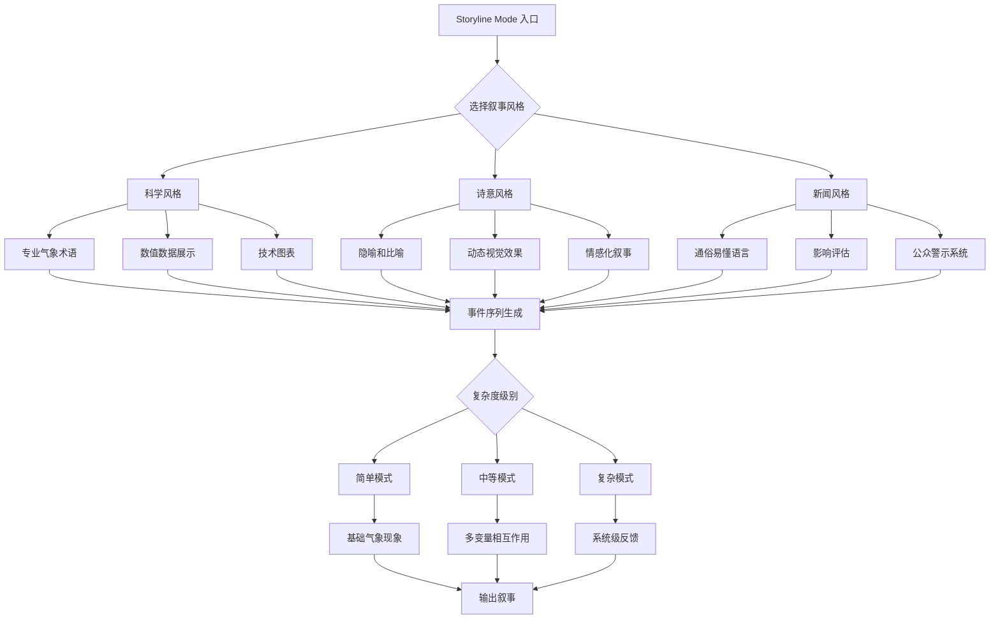
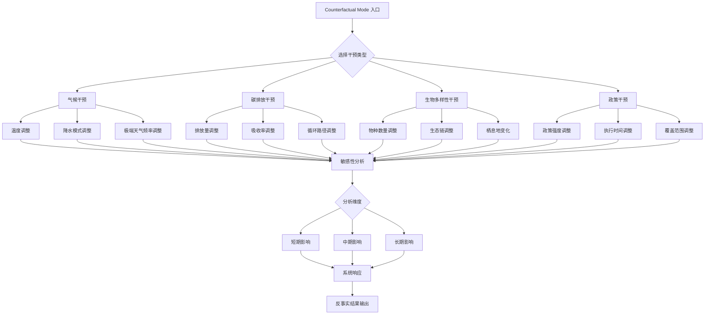
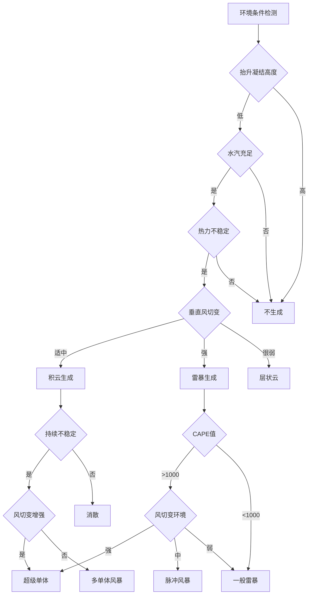
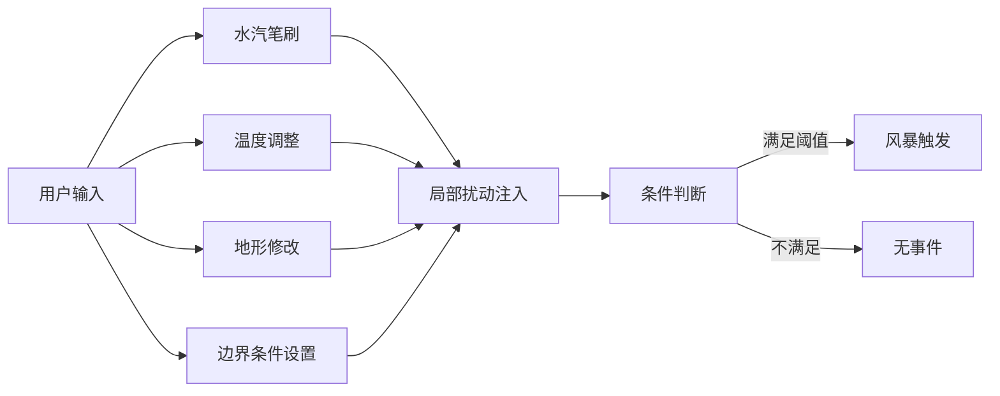
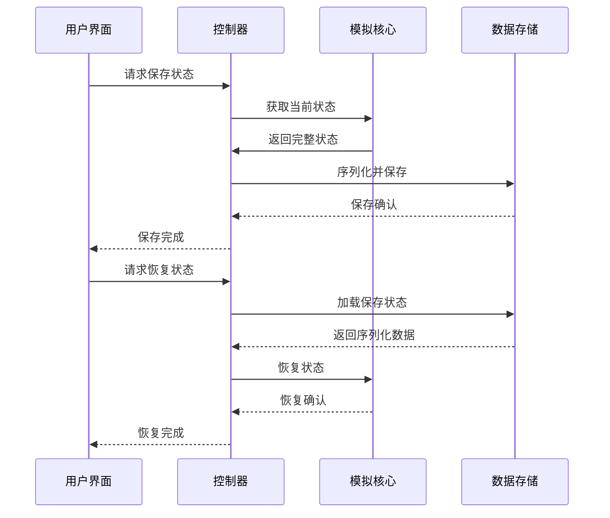
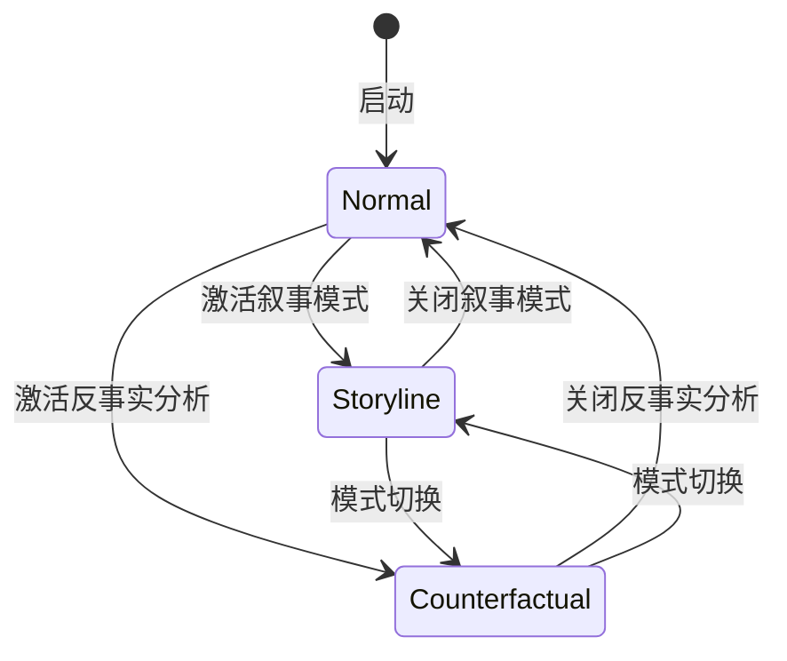
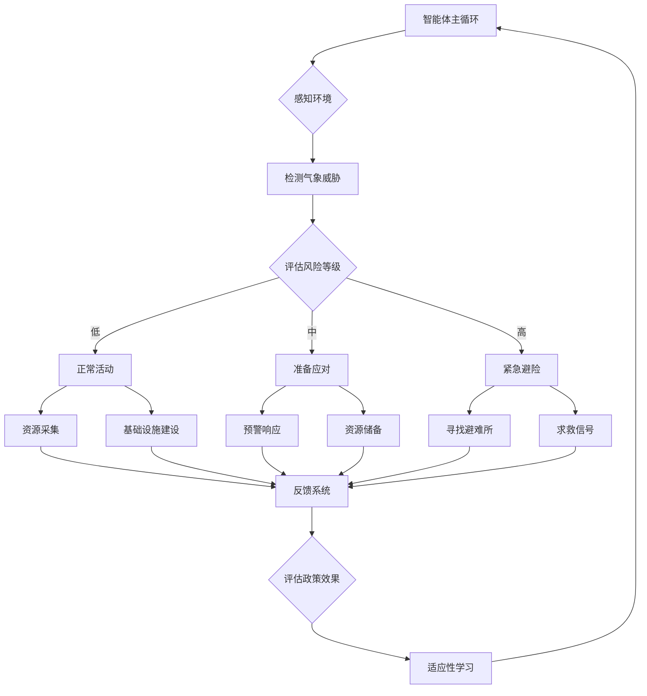

# 故事线模式与反事实分析

## Storyline Mode 逻辑树

```mermaid
graph TD
    A[Storyline Mode 入口] --> B{选择叙事风格}
    B --> C[科学风格]
    B --> D[诗意风格]
    B --> E[新闻风格]
    
    C --> C1[专业气象术语]
    C --> C2[数值数据展示]
    C --> C3[技术图表]
    
    D --> D1[隐喻和比喻]
    D --> D2[动态视觉效果]
    D --> D3[情感化叙事]
    
    E --> E1[通俗易懂语言]
    E --> E2[影响评估]
    E --> E3[公众警示系统]
    
    C1 --> F[事件序列生成]
    C2 --> F
    C3 --> F
    D1 --> F
    D2 --> F
    D3 --> F
    E1 --> F
    E2 --> F
    E3 --> F
    
    F --> G{复杂度级别}
    G --> H[简单模式]
    G --> I[中等模式]
    G --> J[复杂模式]
    
    H --> K[基础气象现象]
    I --> L[多变量相互作用]
    J --> M[系统级反馈]
    
    K --> N[输出叙事]
    L --> N
    M --> N
```

## Counterfactual Mode 分支树

```mermaid
graph TD
    A[Counterfactual Mode 入口] --> B{选择干预类型}
    B --> C[气候干预]
    B --> D[碳排放干预]
    B --> E[生物多样性干预]
    B --> F[政策干预]
    
    C --> C1[温度调整]
    C --> C2[降水模式调整]
    C --> C3[极端天气频率调整]
    
    D --> D1[排放量调整]
    D --> D2[吸收率调整]
    D --> D3[循环路径调整]
    
    E --> E1[物种数量调整]
    E --> E2[生态链调整]
    E --> E3[栖息地变化]
    
    F --> F1[政策强度调整]
    F --> F2[执行时间调整]
    F --> F3[覆盖范围调整]
    
    C1 --> G[敏感性分析]
    C2 --> G
    C3 --> G
    D1 --> G
    D2 --> G
    D3 --> G
    E1 --> G
    E2 --> G
    E3 --> G
    F1 --> G
    F2 --> G
    F3 --> G
    
    G --> H{分析维度}
    H --> I[短期影响]
    H --> J[中期影响]
    H --> K[长期影响]
    
    I --> L[系统响应]
    J --> L
    K --> L
    
    L --> M[反事实结果输出]
```

## 风暴生成规则

### 基础生成规则

```mermaid
flowchart TD
    A[环境条件检测] --> B{抬升凝结高度}
    B -->|低| C{水汽充足}
    B -->|高| Z[不生成]
    C -->|是| D{热力不稳定}
    C -->|否| Z
    D -->|是| E{垂直风切变}
    D -->|否| Z
    E -->|适中| F[积云生成]
    E -->|强| G[雷暴生成]
    E -->|很弱| H[层状云]
    
    F --> I{持续不稳定}
    I -->|是| J{风切变增强}
    I -->|否| K[消散]
    J -->|是| L[超级单体]
    J -->|否| M[多单体风暴]
    
    G --> N{CAPE值}
    N -->|>1000| O{风切变环境}
    N -->|<1000| P[一般雷暴]
    O -->|强| L
    O -->|中| R[脉冲风暴]
    O -->|弱| P
```

## 触发机制

### 人工触发机制

```mermaid
graph LR
    A[用户输入] --> B[水汽笔刷]
    A --> C[温度调整]
    A --> D[地形修改]
    A --> E[边界条件设置]
    
    B --> F[局部扰动注入]
    C --> F
    D --> F
    E --> F
    
    F --> G[条件判断]
    G -->|满足阈值| H[风暴触发]
    G -->|不满足| I[无事件]
```

## 保存/恢复机制

```mermaid
sequenceDiagram
    participant UI as 用户界面
    participant Ctrl as 控制器
    participant Core as 模拟核心
    participant Store as 数据存储
    
    UI->>Ctrl: 请求保存状态
    Ctrl->>Core: 获取当前状态
    Core->>Ctrl: 返回完整状态
    Ctrl->>Store: 序列化并保存
    Store-->>Ctrl: 保存确认
    Ctrl-->>UI: 保存完成
    
    UI->>Ctrl: 请求恢复状态
    Ctrl->>Store: 加载保存状态
    Store-->>Ctrl: 返回序列化数据
    Ctrl->>Core: 恢复状态
    Core-->>Ctrl: 恢复确认
    Ctrl-->>UI: 恢复完成
```

## 模式切换逻辑

```mermaid
stateDiagram-v2
    [*] --> Normal: 启动
    Normal --> Storyline: 激活叙事模式
    Normal --> Counterfactual: 激活反事实分析
    Storyline --> Normal: 关闭叙事模式
    Counterfactual --> Normal: 关闭反事实分析
    Storyline --> Counterfactual: 模式切换
    Counterfactual --> Storyline: 模式切换
```

## 智能体行为树

```mermaid
graph TD
    A[智能体主循环] --> B{感知环境}
    B --> C[检测气象威胁]
    C --> D{评估风险等级}
    
    D -->|低| E[正常活动]
    D -->|中| F[准备应对]
    D -->|高| G[紧急避险]
    
    E --> H[资源采集]
    E --> I[基础设施建设]
    F --> J[预警响应]
    F --> K[资源储备]
    G --> L[寻找避难所]
    G --> M[求救信号]
    
    H --> N[反馈系统]
    I --> N
    J --> N
    K --> N
    L --> N
    M --> N
    
    N --> O{评估政策效果}
    O --> P[适应性学习]
    P --> A
```